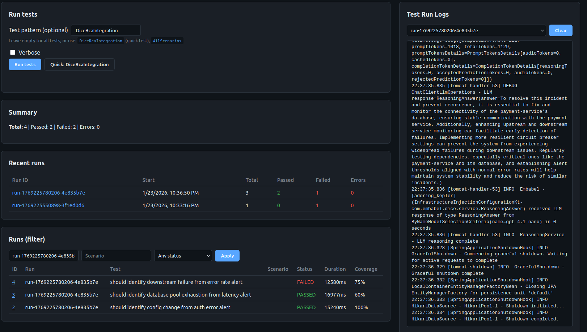

# Datadog RCA Assistant (Embabel + DICE)

AI-powered Root Cause Analysis (RCA) system for production incidents, leveraging **Embabel** AI agents and **DICE** (Domain-Integrated Context Engineering) for intelligent memory and reasoning.

## 🚧 Test Report Server & AI Parameter Tuning UI (Work in Progress) 🚧



The test-report-server provides a web-based interface for running tests, viewing results, and tuning AI parameters to improve detection success across scenarios. See the [Test Report Server & AI Parameter Tuning](#test-report-server--ai-parameter-tuning) section below for details.

## Architecture

The system consists of two primary Kotlin/Spring Boot modules:

1.  **`embabel-dice-rca`**: The analysis engine and AI agent. It collects telemetry from Datadog (logs, metrics, spans), performs pattern analysis, and identifies root cause candidates.
2.  **`dice-server`**: The intelligent memory and reasoning engine. It decomposes incident data into atomic facts (propositions) and provides a reasoning API to answer complex questions about incidents.

## Modules

### 1. RCA Agent (`embabel-dice-rca`)
- **Telemetry Collection**: Interfaces with Datadog REST API.
- **Analysis Engine**: Clusters logs, identifies metric anomalies, and correlates APM traces.
- **AI Agent**: Uses Embabel framework to orchestrate the investigation workflow.
- **DICE Bridge**: Pushes investigation results to the DICE server for persistent memory.

### 2. DICE Server (`dice-server`)
- **Ingestion API**: Receives raw incident data and reports.
- **Proposition Extraction**: Uses LLMs to extract atomic, factual propositions from text.
- **Reasoning Engine**: Provides semantic query capabilities over stored incident memory.
- **Persistence**: Managed factual memory of all incidents.

### 3. Test Report Server (`test-report-server`)
- **Test Execution UI**: Web interface for running integration tests and viewing results.
- **Persistent Test Storage**: H2 database stores all test runs with AI parameters, coverage metrics, and outcomes.
- **AI Parameter Tuning**: Track which parameter combinations (model, temperature, keywords) improve detection success across scenarios.
- **Analysis Dashboard**: View test summaries, filter by scenario/status, and analyze trends over time.

## Setup

### Prerequisites
- Java 21+
- Maven 3.8+
- OpenAI or Anthropic API Key
- Datadog API & App Keys

### Configuration

#### Environment Variables
Set environment variables:
```bash
export OPENAI_API_KEY="sk-..."
export DD_API_KEY="..."
export DD_APP_KEY="..."
export DD_SITE="datadoghq.com"
```

#### IDE Configuration (VS Code)

The project is configured to use **Java 21** and **Kotlin JVM target 21**. If you see IDE errors about JVM target mismatches:

**VS Code Settings** (already configured in `.vscode/settings.json`):
- `kotlin.compiler.jvm.target`: Set to `"21"` to match Maven configuration
- `kotlin.languageServer.enabled`: Enabled for Kotlin language support

**If you see "Cannot inline bytecode built with JVM target 21 into bytecode that is being built with JVM target 1.8"**:
1. Reload VS Code window: `Ctrl+Shift+P` → "Reload Window"
2. Ensure Java 21 is selected as the project SDK
3. The Maven build uses JVM target 21 correctly - this is typically an IDE cache issue

**Maven Configuration**:
- Both modules (`dice-server` and `embabel-dice-rca`) have `jvmTarget=21` configured in their `pom.xml`
- Kotlin Maven plugin version is explicitly set to match Kotlin version

### Running the Services

1. **Start the DICE Server**:
   ```bash
   cd dice-server && mvn spring-boot:run
   ```

2. **Run the RCA Agent**:
   ```bash
   cd embabel-dice-rca && mvn spring-boot:run
   ```

## Testing

### Integration Testing
The project includes a comprehensive integration test harness that simulates a Datadog incident and verifies the full flow from analysis to DICE reasoning:

```bash
cd embabel-dice-rca && mvn test -Dtest=SystemIntegrationTest
```

### Unit Testing
Each module contains unit tests for its core logic:
```bash
cd dice-server && mvn test
cd embabel-dice-rca && mvn test
```

### Test Report Server & AI Parameter Tuning

The test harness provides a web-based UI for iterative tuning of AI parameters to improve detection success across scenarios. Given the complexity of minimal configuration scenarios, the system persists all test results to a local H2 database for analysis.

**Start the Test Report Server:**
```bash
cd test-report-server
mvn spring-boot:run
# Open http://localhost:8081
```

**Key Features for AI Tuning:**

1. **Run Tests from UI**: Execute specific test patterns (e.g., `DiceRcaIntegration`, `AllScenarios`) directly from the web interface with optional verbose logging.

2. **Persistent Test Storage**: All test runs are saved to H2 database (`embabel-dice-rca/test-reports/test-history`) with:
   - AI parameters (model, temperature)
   - Test outcomes (passed/failed, keyword coverage, component/cause identification)
   - Performance metrics (duration, API calls)
   - Full test execution reports (JSON)

3. **Coverage Metrics**: Each test result shows keyword coverage percentage, allowing you to:
   - Identify which scenarios need keyword adjustments
   - Track improvements after parameter changes
   - Compare detection success across different AI model/temperature combinations

4. **Historical Analysis**: View recent runs, filter by scenario or status, and analyze trends:
   - Which parameter combinations yield higher pass rates
   - How keyword coverage correlates with test success
   - Performance impact of different configurations

5. **Real-time Logs**: The UI displays test execution logs including:
   - LLM model used (e.g., `gpt-4.1-nano`)
   - Token usage (prompt/completion tokens)
   - AI reasoning answers
   - System lifecycle events

**Workflow for Tuning:**
1. Run tests from the UI with current parameters
2. Review coverage metrics and pass/fail rates in the dashboard
3. Adjust AI parameters (temperature, model, expected keywords) based on results
4. Re-run tests and compare outcomes in the "Recent runs" table
5. Use the H2 database for deeper analysis (see `embabel-dice-rca/docs/TEST_REPORT_ANALYSIS.md` for SQL queries)

The persistent storage enables data-driven tuning: identify which parameter adjustments improve detection success for specific scenarios, track improvements over time, and optimize the AI configuration for production use.

See [test-report-server/README.md](test-report-server/README.md) for detailed API and configuration options.

## Documentation
- [Architecture Diagrams](embabel-dice-rca/docs/architecture/README.md)
- [PlantUML Setup Guide](docs/puml-setup.md)
