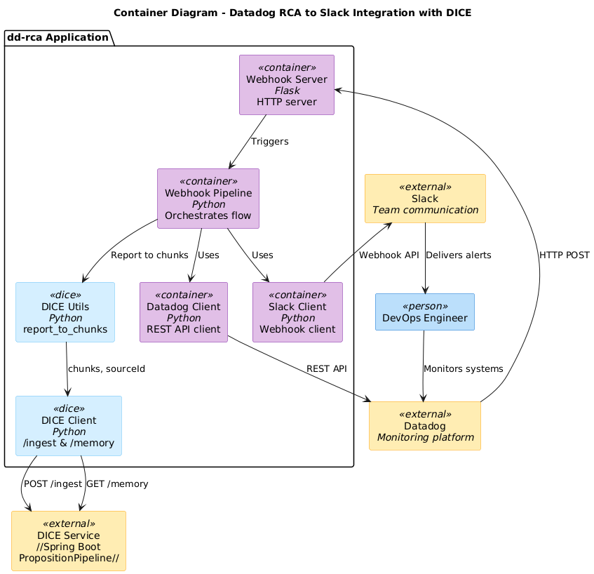
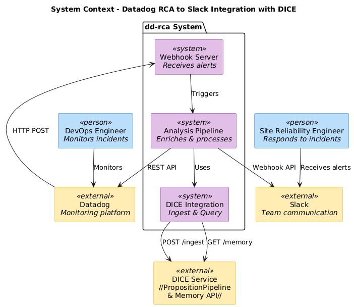
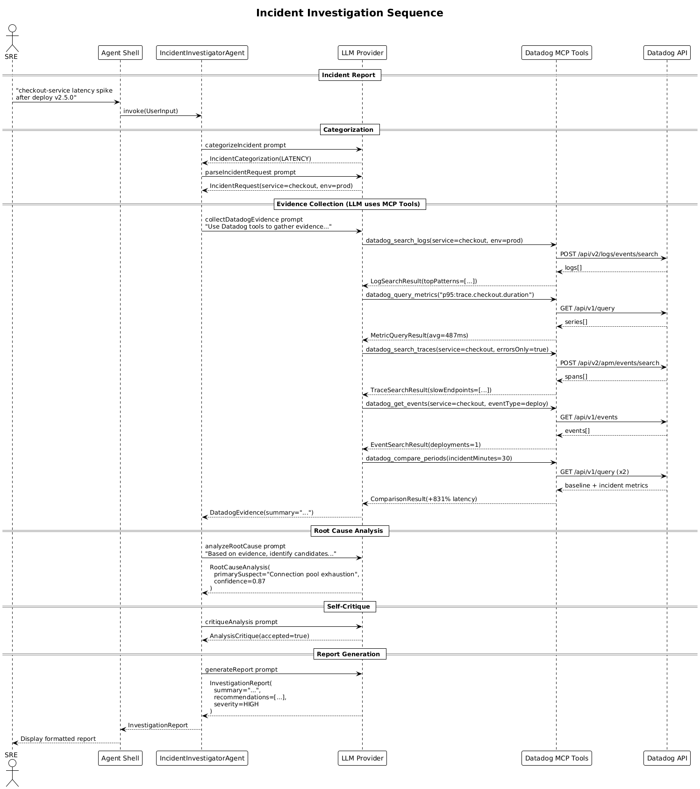
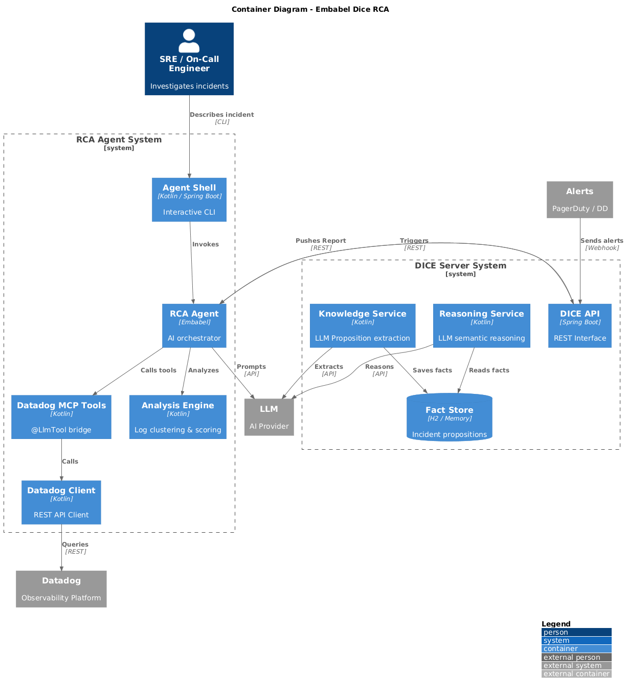

# Architecture Diagrams

This document provides an overview of all architecture diagrams for the Datadog RCA Assistant (Embabel + DICE) project. All diagrams document the modern Kotlin/Spring Boot implementation and are organized by architecture view using the C4 model.

## Table of Contents

- [Modern Kotlin/Spring Boot C4 Diagrams](#modern-kotlinspring-boot-c4-diagrams)
- [Sequence Diagrams](#sequence-diagrams)
- [Workflow Diagrams](#workflow-diagrams)

---

## Modern Kotlin/Spring Boot C4 Diagrams

These diagrams document the current Kotlin/Spring Boot implementation using the C4 model for architecture documentation.

### System Context Diagram

**File:** [c4-context.png](img/c4-context.png)



**Description:** High-level view showing the Embabel RCA Agent system and its relationships with users (SRE, Platform Engineer), external systems (Datadog, LLM Provider, Alerting Systems, Chat Platforms), and the DICE Server. Demonstrates how the AI-powered incident analysis system fits into the overall observability ecosystem.

### Container Diagram

**File:** [c4-container.png](img/c4-container.png)


**Description:** Details the container architecture of both the RCA Agent System (Agent Shell, RCA Agent, MCP Tools, Analysis Engine, Datadog Client) and the DICE Server System (DICE API, Knowledge Service, Reasoning Service, Fact Store). Shows how components interact across system boundaries and technology choices (Kotlin/Spring Boot vs. Python).

### Component Diagram

**File:** [c4-component.png](img/c4-component.png)


**Description:** Internal component structure of the RCA Agent showing the main RcaAgent orchestrator, its action components (categorize, parse, collect, analyze, report), the MCP Tools bridge for Datadog integration, analysis engine components (LogAnalyzer, MetricAnalyzer, ScoringEngine), and the DatadogClient interface with its implementations.

### Deployment Diagram

**File:** [c4-deployment.png](img/c4-deployment.png)


**Description:** Deployment architecture showing both development (JVM 21 on developer machines) and production (Kubernetes clusters) deployments. Includes secrets management, external Datadog cloud services, and DICE server deployment options. Demonstrates how the system scales from local development to cloud production environments.

### Datadog MCP Tools Component Diagram

**File:** [c4-mcp-tools.png](img/c4-mcp-tools.png)



**Description:** Detailed component view of the Datadog MCP (Model Context Protocol) Tools that bridge LLM agents with Datadog APIs. Shows all six tools (search_logs, query_metrics, search_traces, get_events, get_monitor, compare_periods) and their relationships with DatadogClient and analysis helper components. These tools enable LLM agents to autonomously query Datadog during incident investigation.

---

## Sequence Diagrams

These diagrams show the temporal flow of interactions between system components during key operations.

### Incident Investigation Sequence

**File:** [sequence-investigation.png](img/sequence-investigation.png)



**Description:** End-to-end sequence diagram showing how an SRE interacts with the Agent Shell to investigate an incident. Details the flow from initial categorization through evidence collection (where the LLM autonomously uses MCP tools to query Datadog), root cause analysis, and report generation. Demonstrates the AI-driven investigation workflow.

### DICE Alert Ingestion Sequence

**File:** [sequence-dice-ingestion.png](img/sequence-dice-ingestion.png)



**Description:** Sequence diagram showing how Datadog alerts are ingested into DICE. Illustrates the flow from alert trigger through the DICE API to the KnowledgeService, which extracts propositions using LLM, stores them in the PropositionStore, and how the RCA Agent can then be triggered to perform analysis and update the DICE memory with investigation results.

---

## Workflow Diagrams

These diagrams illustrate the step-by-step workflows and decision flows within the system.

### Embabel Agent Workflow

**File:** [agent-workflow.png](img/agent-workflow.png)


**Description:** Activity diagram showing the complete incident investigation workflow orchestrated by the Embabel Agent. Details each step from user input through categorization, parsing, evidence collection (using MCP tools), root cause analysis, critique/quality review, and report generation. Includes retry logic for unsatisfactory analysis and demonstrates the goal-driven nature of the agent.

---

## Diagram Source Files

All diagrams are generated from PlantUML source files located in:

- **Modern C4 diagrams:** [`embabel-dice-rca/docs/architecture/`](../embabel-dice-rca/docs/architecture/)

To regenerate images, use:

```bash
# Generate all images
java -jar tools/plantuml/plantuml.jar -tpng -o docs/img embabel-dice-rca/docs/architecture/*.puml
```

## Diagram Conventions

### C4 Model
The modern diagrams follow the [C4 model](https://c4model.com/) conventions:
- **Context:** Shows system boundaries and external dependencies
- **Container:** Shows applications and data stores
- **Component:** Shows internal component structure
- **Deployment:** Shows infrastructure and deployment topology

### Color Coding
- **Purple boxes:** Internal systems/components
- **Orange boxes:** External systems
- **Blue boxes:** Users/persons
- **Light blue boxes:** DICE-related components

---

## Additional Resources

- [Architecture Documentation](../embabel-dice-rca/docs/architecture/README.md)
- [PlantUML Setup Guide](puml-setup.md)
- [DICE Setup Guide](DICE_SETUP.md)
