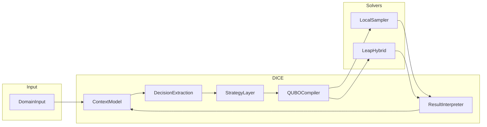

# DICE + D-Wave Leap Integration Spec

> **Purpose:** Show how **DICE** (Decision Intelligence + Context Engine) turns structured decision problems into **QUBO/BQM** models, picks a solver (local classical or **D-Wave Leap**), and folds results back into an **agentic reasoning** loop.

---

## Core thesis

| Role | What it is |
|------|------------|
| **DICE** | A **compiler and orchestrator** of decision problems—not the solver itself. |
| **D-Wave Leap** | One **pluggable** execution backend alongside classical samplers. |

---

## Architecture (pipeline)

End-to-end data flow:

```text
Domain input
  → DICE context model
  → Decision extraction
  → Optimization strategy layer
  → QUBO compiler
  → Solver adapter (local | D-Wave Leap)
  → Result interpreter
  → DICE feedback loop
```



---

## Core components

### DICE context model

- **Entities** — e.g. services, actions, hypotheses.
- **Attributes** — cost, signal, risk, confidence, etc.
- **Relationships** — dependencies, conflicts.
- **Constraints** — hard rules and soft penalties.

### Decision extraction

Maps context to:

- Candidate **binary** decisions  
- **Objective** signals  
- A **constraint graph**  

Example decision set:

```text
decisions = ["A", "B", "C", "Deploy_X"]
```

### Optimization strategy layer

Chooses among heuristic ranking, search, or full QUBO optimization.

**Example rollover triggers** (tune per deployment):

- `candidate_count > 12`
- `constraint_edges > 8`
- Multi-objective tradeoffs
- Conflicting top-ranked options

### QUBO compiler

- **Objective:** minimize \(x^\top Q x\).
- **Mapping (conceptual):**
  - decision → binary variable \(x_i\)
  - cost → positive diagonal contribution
  - signal → negative diagonal contribution (maximize signal ↔ lower energy)
  - conflict → positive pairwise penalty
  - dependency → penalty when violated (soft constraint)

### Solver adapter

- **Local:** simulated annealing, tabu search, etc. (e.g. Ocean / `neal`).
- **D-Wave:** `LeapHybridSampler` (hybrid / cloud path).
- **Interface idea:** `solve(Q, mode)` with `mode ∈ {local, dwave}`.

### Result interpreter

Reads samples (e.g. variables with value `1`) and maps them back to **domain entities**.

### DICE feedback loop

Evaluates solution quality, updates context, optionally **re-solves** with new constraints, and chooses the next agent action.

---

## Example domain

| Entity | Cost | Signal |
|--------|------|--------|
| A | 2 | 5 |
| B | 3 | 4 |
| C | 1 | 3 |
| Deploy_X | 4 | 2 |

**Relationships**

- **Conflict:** `A` ↔ `B` (not both selected).
- **Dependency:** `Deploy_X` depends on `A`.

---

## QUBO construction (sketch)

- **Diagonals:** \(Q_{ii} = \text{cost}(i) - \text{signal}(i)\) (minimize cost, maximize signal in one objective).
- **Conflicts:** e.g. \(Q_{A,B} = +5\) when both selected is penalized.
- **Builder pattern:** iterate entities for diagonals; iterate relationships for off-diagonal penalties.

*(Exact encoding of dependencies may add linear and quadratic terms—see `dice-leap-poc` implementation.)*

---

## End-to-end flow

1. DICE ingests domain context.  
2. DICE extracts candidate decisions.  
3. DICE evaluates complexity and **selects strategy**.  
4. If optimization applies: compile QUBO and **select solver backend**.  
5. Solve (local or Leap).  
6. Interpret result → selected decisions.  
7. Update context and continue the reasoning loop.

---

## Design principles

| Principle | Meaning |
|-----------|---------|
| **Solver-agnostic** | DICE does not require D-Wave; **default to local** when appropriate. |
| **Optimization as a tool** | Use QUBO when interactions/constraints beat simple ranking. |
| **Iterative refinement** | Reuse solutions as seeds; re-optimize as constraints change. |
| **Explainability** | Log *why* optimization ran, *what* constraints applied, *why* the solution was chosen. |

---

## Metrics

Track at least:

- Solution quality **vs heuristic baseline**
- Runtime (compile + solve)
- Leap usage / cost (when enabled)
- Stability across runs (fixed seeds where relevant)
- Constraint satisfaction (post-interpretation)

---

## Extensions (future)

- **Reverse-annealing-style** loops: warm-start from prior samples.  
- **Multi-objective:** weighted cost / signal / risk.  
- **Workflows:** solver as a node in a DAG or pipeline.  
- **More domains:** incident triage, sequencing, scheduling, allocation.

---

## Constraints & scope

- Start with **≤ ~30 variables** for PoC-scale problems.  
- Prefer **hybrid** solver path for larger structured instances when using Leap.  
- **QPU** is optional; most value is in **QUBO design**, not raw hardware access.

---

## Implementation plan

| Phase | Focus | Status (repo) |
|-------|--------|----------------|
| **1** | QUBO compiler, **local** SA (`neal`), strategy rollover, tiered fixtures, pytest, JSONL | **Done** (`dice-leap-poc/`) |
| **2** | D-Wave Leap via `LeapHybridSampler` + `solver_mode` (`local_classical` / `leap_hybrid`) | **In progress** — optional `[leap]` extra; CI stays local-only |
| **3** | Realistic synthetic data (≈15–30 entities + constraints): triggers vs baseline | **Largely done** in PoC fixtures; refine with real cases later |

**Repo layout:** `dice-leap-poc/` — strategy, compiler, solvers (`solve_local`, `solve_leap`), pipeline, tests, **`sample_data/`** with fixtures that **simulate rollover** (tier simple/complex + metric boundaries at `n>12` / `edges>8`). *(See [dice-leap-poc/sample_data/README.md](dice-leap-poc/sample_data/README.md), [dice-leap-poc/README.md](dice-leap-poc/README.md), [milestones/milestone-1.md](milestones/milestone-1.md).)*

**CI:** GitHub Actions workflow `.github/workflows/dice-leap-poc.yml` runs `pytest` with **no** Leap credentials and **no** `dwave-system` install. **test-report-server** has `.github/workflows/test-report-server.yml` for Maven tests.

**Ingest:** Kotlin `SolveRecord` + JSONL reader under `embabel-dice-rca/.../dice/solver/`; optional `GET /api/solver-runs` on test-report-server over `dice-leap-poc/runs/*.jsonl`.

---

## Leap setup (Phase 2)

```bash
cd dice-leap-poc
pip install -e ".[dev,leap]"
export DWAVE_API_TOKEN="..."   # or use `dwave setup`
```

Smoke-test (optional; **skipped** in CI without token):

```bash
pytest tests/test_leap.py -m leap -q
```

`run_instance(..., solver_mode="leap_hybrid", leap_time_limit_s=...)` uses `dwave.system.LeapHybridSampler`. Without `[leap]` installed, you get an `ImportError` with install instructions.

---

## Summary

DICE acts as a **decision compiler**; QUBO is a **universal optimization shape**; Leap is a **pluggable backend** inside an **agentic** loop that can revisit decisions as context evolves.

### One-line pitch

**DICE compiles structured decision problems into optimization models and can run them on D-Wave Leap (or local samplers) inside a reasoning loop.**
