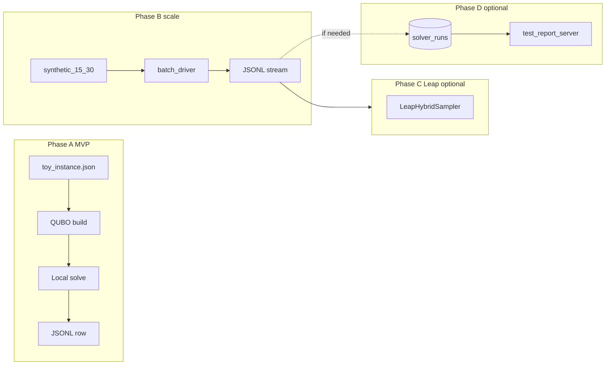

# Milestone 1 — D-Wave / QUBO PoC & synthetic dataset

**Status:** **Phase 1 (local) complete** — tiered fixtures, strategy rollover, pytest acceptance, JSONL batch, metrics plan doc. **Phase 2** = Leap adapter (optional) + optional CI. **Phase 3** = real-data instrumentation (post-PoC).  
**Spec reference:** [dwave.md](../dwave.md) (reformatted spec + diagrams)  
**Implementation:** [dice-leap-poc/README.md](../dice-leap-poc/README.md)  
**Last plan iteration:** 2026-01-24 (pass 2) — Phase 2 broken into DoD + CI spec + Leap conventions + open decisions.

---

## What shipped (Phase 1 snapshot)

Use this as the baseline for future iterations:

| Area | Location / notes |
|------|------------------|
| Instance → QUBO → BQM | `dice_leap_poc/qubo.py`, `instance.py` |
| Greedy baseline | `dice_leap_poc/baseline.py` |
| Local SA | `dice_leap_poc/solve_local.py` (neal) |
| Strategy (tier + rollover metrics) | `dice_leap_poc/strategy.py` — `tier: simple\|complex`; else `n>12` or `edges>8` |
| Pipeline + `SolveRecord` | `dice_leap_poc/pipeline.py`, `record.py` |
| Batch + tier aggregates | `dice_leap_poc/batch.py`, `scripts/batch_sample.py` |
| Fixtures | `sample_data/toy_dw_md.json` (simple), `sample_data/complex_dw_md.json` (18 vars, QUBO win vs greedy) |
| Schema | `dice-leap-poc/schemas/solve_record.schema.json` |
| Tests | `tests/test_mvp.py`, `tests/test_acceptance.py` (14 tests) |
| Real-world metrics **plan** (doc only) | [docs/DWAVE_REAL_WORLD_METRICS.md](../docs/DWAVE_REAL_WORLD_METRICS.md) |

---

## Overview (unchanged intent)

- **Phase 1:** Python **`dice-leap-poc/`** with **dimod + neal** only — **no Leap** in default path.
- **Phase 2 (optional):** **Leap** via `LeapHybridSampler`; credentials gated; **CI stays local-only** unless you add an opt-in job.
- **PoC bar (met for simulated data):** Simple tier → heuristic (or parity); complex tier → QUBO path + **superiority vs same baseline**; strategy reasons + `vs_baseline_delta` in JSONL; **pytest** locks acceptance.
- **GUI:** [test-report-server](../test-report-server/) **optional** (L2); JSONL-first.

---

## Work items (checklist)

### Done (Phase 1)

- [x] **repo-prep-gitignore** — Python + `dice-leap-poc/runs/`; `.dwave/` for Phase 2 tokens.
- [x] **mvp-e2e** — Toy → QUBO → local solve → JSONL; property tests.
- [x] **contract-schema** — `SolveRecord` JSON Schema + README; `solver_mode` documents `leap_hybrid` for Phase 2.
- [x] **package-layout** — `requirements.txt`, `pyproject.toml`, `pytest.ini` (`pythonpath`).
- [x] **baseline-heuristic** — Greedy on same BQM; `vs_baseline_delta` in record.
- [x] **synthetic-dataset** — Tiered `sample_data/`; complex ≤30 vars; batch + aggregates.
- [x] **synthetic-iterate** — Acceptance margins in `test_acceptance.py` (`COMPLEX_MIN_MARGIN`, etc.).
- [x] **real-world-metrics-plan** — `docs/DWAVE_REAL_WORLD_METRICS.md` (collection **after** PoC).

### Next (Phase 2 — prioritized)

Work is split into **M1a (CI)** and **M1b (Leap)** so CI can land without cloud deps.

| ID | Item | Depends on | Definition of done |
|----|------|------------|-------------------|
| **5c** | **ci-dice-leap-poc** | — | PR checks run `pytest` under `dice-leap-poc/` on default branch + PRs; **no** `dwave-hybrid` install; green on clean checkout. |
| **6a** | **pipeline-solver-switch** | 5c (nice to parallelize with 6b) | `run_instance(..., solver_mode=...)` with default `local_classical`; code path for `leap_hybrid` either calls adapter or raises clear `NotImplementedError` until 6b lands (avoid half-wired API). |
| **6b** | **leap-adapter** | 6a | `LeapHybridSampler` (or documented wrapper); creds from env; **pytest skip** when token missing; optional `[leap]` extra in `pyproject.toml`. |
| **6c** | **milestone-doc-leap** | 6b | [dwave.md](../dwave.md) Phase 2 row + README “Leap” section: setup, env vars, **CI does not require Leap**. |

Concrete checklist (same as table):

- [ ] **ci-dice-leap-poc** — See [§ CI workflow spec](#ci-workflow-spec-m1a) below.
- [ ] **leap-adapter** — See [§ Leap adapter conventions](#leap-adapter-conventions-m1b) below.
- [ ] **pipeline-solver-switch** — `run_instance(..., solver_mode=...)`; `SolveRecord.solver_mode` matches actual backend; document timeout / fallback (default: **fail fast** or **fallback to neal** — pick one in [open decisions](#open-decisions)).
- [ ] **milestone-doc-leap** — Update [dwave.md](../dwave.md) “Implementation plan” table with Phase 2 done criteria.

### Later / optional

- [ ] **persist-l2** — `solver_runs` H2 + test-report-server API if JSONL insufficient.
- [ ] **persist-l1** — Mirror JSONL under `embabel-dice-rca/test-reports/` in CI or manual export.
- [ ] **contract-evolution** — Optional `encoding_version` / `qubo_schema_version` field on `SolveRecord` when Kotlin ingest or encodings change.
- [ ] **kotlin-ingest** — Thin client or batch job to read JSONL / HTTP; **defer** until contract stable.

---

## Goals (unchanged)

1. **Simulated superiority on complex tier** — achieved with `complex_dw_md` + local SA + pytest margin.
2. **End-to-end path first** — maintained; extend with solver adapter only.
3. **Contract-first** — keep schema + README in sync when adding Leap fields (e.g. `leap_job_id` optional later).
4. **JSONL (L0)** — default persistence.
5. **CI** — local solver only by default; Leap **never** required in CI.

---

## Execution order (updated)

| Step | Deliverable | Status |
|------|-------------|--------|
| 1 | MVP slice | **Done** |
| 2 | SolveRecord schema | **Done** |
| 3 | Package layout + pytest | **Done** |
| 4 | Heuristic baseline | **Done** |
| 5 | Tiered synthetic dataset + batch | **Done** |
| 5b | Acceptance (simple heuristic / complex QUBO + margin) | **Done** |
| **5c** | **CI workflow for `dice-leap-poc`** | **Next** |
| 6 | Leap adapter + creds-gated tests | Optional after 5c |
| 7 | Persist L2 (H2/API) | Optional |

---

## Solver rollout (required order)

1. **Phase 1 — Local only:** **Done** (neal SA).
2. **Phase 2 — Leap:** Adapter + skip-if-no-creds tests; **do not** block PRs on cloud quota.

Use explicit **`solver_mode`**: `local_classical` | `leap_hybrid`.

---

## Test data: rollover + QUBO superiority

| Tier | Intent |
|------|--------|
| **Simple / below-rollover** | Heuristic-only strategy (or parity); `toy_dw_md` + `fixture_tier_simple`. |
| **Complex / above-rollover** | QUBO strategy; local SA; **measurable** `vs_baseline_delta` ≥ agreed margin; `complex_dw_md`. |

Rollover **without** `tier` in JSON: `n_entities > 12` or `n_conflicts + n_dependencies > 8` (`RolloverConfig` in code).

---

## Synthetic iteration loop

1. Batch fixtures (`scripts/batch_sample.py` or `batch.run_fixtures`).
2. Inspect JSONL: `vs_baseline_delta`, `strategy_reason`.
3. **Gates:** `test_acceptance.py` + `test_mvp.py`; adjust `COMPLEX_MIN_MARGIN` / seeds if SA flakes (increase `num_reads` in tests).
4. Tune penalties in JSON fixtures only when gates fail for **domain** reasons.

---

## Persistence ladder

- **L0:** `dice-leap-poc/runs/*.jsonl` (default).
- **L1:** Optional mirror under `embabel-dice-rca/test-reports/`.
- **L2:** `solver_runs` + test-report-server UI.

---

## GUI (test-report-server)

Not required for Milestone 1 closure. Optional: surface `vs_baseline_delta` / solver mode from ingested JSONL.

---

## Technical choices

- **Phase 1 deps:** `dimod`, `dwave-neal` (as pinned in `requirements.txt` / `pyproject.toml`).
- **Phase 2 deps:** `dwave-hybrid` optional extra; never in default CI install if avoidable.
- **Strategy:** Implemented; thresholds live in `strategy.py` — keep aligned with acceptance tests when changing dwave.md triggers.
- **Explainability:** `strategy_reason`; optional future sparse Q summary (not full matrix).

---

## Documentation

- Concept + structure: [dwave.md](../dwave.md).
- PoC runbook: [dice-leap-poc/README.md](../dice-leap-poc/README.md).
- Pilot metrics (planning): [docs/DWAVE_REAL_WORLD_METRICS.md](../docs/DWAVE_REAL_WORLD_METRICS.md).

---

## Risks

- Leap quota/cost; keep hybrid problem size ≤ guidance in dwave.md.
- **Scope:** Simulated PoC first; production RCA wiring out of scope unless explicitly added.
- **CI:** Flaky SA → prefer fixed seeds + sufficient `num_reads` in tests.

---

## CI workflow spec (M1a)

*Repo currently has no `.github/workflows/` for Python; add when implementing **5c**.*

Suggested shape:

- **Path:** `.github/workflows/dice-leap-poc.yml` (or a monorepo job in an existing workflow with `paths: [ 'dice-leap-poc/**', ... ]`).
- **Trigger:** `pull_request` + `push` to default branch (optionally restrict paths to `dice-leap-poc/**` to save minutes).
- **Runner:** `ubuntu-latest`.
- **Steps:** `actions/checkout`, `setup-python` (e.g. **3.10** and **3.12** matrix optional), `pip install -r dice-leap-poc/requirements.txt` (or `pip install -e "dice-leap-poc/[dev]"`), `pytest dice-leap-poc/tests -q` with `working-directory` or `cd`.
- **Not installed:** `dwave-hybrid`, Ocean Leap SDK auth — **never** required for green CI.
- **Optional:** `pip cache` / `actions/cache` for `.venv` speedups.

---

## Leap adapter conventions (M1b)

- **Credentials:** Prefer **`DWAVE_API_TOKEN`** (or document the exact variable `dwave-ocean-sdk` expects on your platform); never commit `.dwave/`; already gitignored.
- **Tests:** `pytest.importorskip` or `@pytest.mark.skipif(not os.environ.get("DWAVE_API_TOKEN"), ...)` for any test that hits the cloud; single **smoke** test is enough initially (tiny BQM).
- **Markers:** Optional `@pytest.mark.leap` so local runs can `-m "not leap"`.
- **Problem size:** Start with **toy** or **trivial** BQM for smoke; complex fixture may exceed free tier or time limits — document max vars for Leap smoke in README.
- **Record fields (later):** Optional `leap_job_id`, `leap_solver_time_ms` on `SolveRecord` — add to JSON Schema when implemented.

---

## Open decisions

Record outcomes here as you decide (keeps iteration honest):

| Topic | Options | Notes |
|-------|---------|--------|
| Leap failure policy | Fail vs fallback to neal SA | Affects ops predictability vs always getting a sample. |
| `solver_mode` default when strategy is QUBO | Always `local_classical` until env forces Leap | Simplest for CI; Leap opt-in via env flag. |
| Python versions in CI | 3.10 only vs matrix | Match Kotlin/tooling policy for the org. |
| M1 “complete” label | After 5c only vs after 6b | **Recommendation:** call **Milestone 1 done** after **5c**; track Leap as **M1b** or **Milestone 1.1**. |
| Optional `encoding_version` on `SolveRecord` | Yes / defer | Needed before Kotlin ingest of JSONL. |

---

## SolveRecord contract (Phase 2 deltas)

When implementing Leap, update together:

1. [schemas/solve_record.schema.json](../dice-leap-poc/schemas/solve_record.schema.json)
2. [dice_leap_poc/record.py](../dice-leap-poc/dice_leap_poc/record.py)
3. [dice-leap-poc/README.md](../dice-leap-poc/README.md) field table

**Candidate optional fields:** `leap_job_id` (string, nullable), `solver_backend` (string, e.g. `neal` / `leap_hybrid`), `encoding_version` (string, nullable). Only add fields you will actually emit.

---

## Maintenance & regression

- Re-run **`scripts/batch_sample.py`** after changing `strategy.py` thresholds or fixture JSON; spot-check JSONL `strategy_reason` / `vs_baseline_delta`.
- If **neal** or **dimod** major versions bump, re-run full `pytest` and consider locking upper bounds in `requirements.txt`.
- **Complex fixture** (`complex_dw_md.json`) is hand-tuned; if regenerated, re-verify `COMPLEX_MIN_MARGIN` in `test_acceptance.py`.

---

## Real-world analysis (metrics to plan for)

*Deliverable authored:* [docs/DWAVE_REAL_WORLD_METRICS.md](../docs/DWAVE_REAL_WORLD_METRICS.md). **Implement field collection in apps/telemetry after** Phase 2 decisions (Leap or not).

Summary dimensions: problem context, instance complexity, baseline vs QUBO paths, outcomes, operations, governance — see doc for tables.

---

## Out of scope (unless a new milestone says otherwise)

- Replacing RCA keyword verification with QUBO.
- Full agent DAG “solver as node.”
- Live Datadog → QUBO pipeline before adapter + metrics instrumentation are agreed.

---

## Flow (reference)

---

## Plan evolution notes

- **2026-01-24 (pass 1):** Phase 1 local + tiered acceptance **closed**; checklist split into **Done / Next / Later**; added **5c CI**, Leap **pipeline switch**, optional **contract versioning** and **L1** mirror.
- **2026-01-24 (pass 2):** **M1a / M1b** split; **CI workflow spec** (path, triggers, no Leap); **Leap conventions** (env, skip tests, markers); **open decisions** table; **SolveRecord Phase 2 deltas**; **maintenance/regression** notes; **DoD table** for Phase 2 items.
- Vertical slice preserved; **local-then-Leap** gate explicit.
- Real-world metrics: **doc done**, **instrumentation** = post–Phase 2 decision.
