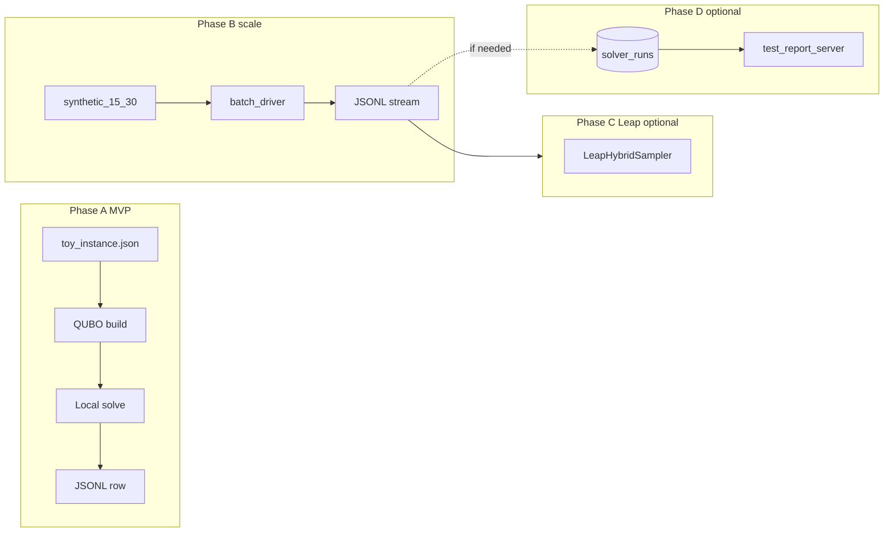

# Milestone 1 — D-Wave / QUBO PoC & synthetic dataset

**Status:** Phase 1 in progress (local PoC + tiered acceptance; Leap optional)  
**Spec reference:** [dwave.md](../dwave.md) (DICE + QUBO + Leap concept)  
**Last aligned with plan:** D-Wave dataset expansion (optimized)

## Overview

- **Phase 1:** Python-first **`dice-leap-poc/`** using **D-Wave Ocean / dimod locally only** (classical samplers, e.g. neal simulated annealing)—**no Leap cloud** until Phase 2.
- **Phase 2 (optional):** **Leap** via `LeapHybridSampler` after Phase 1 + tiered acceptance tests pass; credentials gated; CI may stay local-only.
- **PoC bar:** Tiered **simulated** data where **simple** instances favor heuristic (or QUBO ≈ baseline within ε) and **complex** instances show **measurable QUBO superiority** vs the same heuristic baseline (`vs_baseline_delta` / objective or constraint satisfaction), plus **strategy rollover** to QUBO on the complex tier. **pytest** (or script exit codes) lock acceptance.
- **Follow-on:** Documented **real-world metrics collection plan** ([§ Real-world metrics](#real-world-analysis-with-real-data-metrics-to-plan-for))—author `docs/DWAVE_REAL_WORLD_METRICS.md` after PoC; do not implement full live pipelines until PoC green.
- **GUI:** [test-report-server](../test-report-server/) changes **optional** (L2); JSONL-first.

## Work items (checklist)

- [x] **repo-prep-gitignore** — Extend root `.gitignore` for Python artifacts and `dice-leap-poc/runs/` (JSONL); Phase 2: ignore Leap config paths / tokens.
- [x] **mvp-e2e** — Toy instance → QUBO → **local** dimod/neal solve → one JSONL row; golden/property checks (**no cloud**).
- [x] **contract-schema** — `SolveRecord` JSON schema: `instance_id`, `solver_mode` (`local_classical` | `leap_hybrid`), `strategy_choice` (`heuristic_only` | `qubo`), `strategy_reason`, `n_vars`, `objective`, `selected_decisions`, `runtime_ms`, `vs_baseline_delta`; Phase 1 emits `local_classical` only; document in README.
- [x] **package-layout** — `dice-leap-poc` package, `pyproject.toml` or `requirements.txt`, README (local Ocean install; Leap deferred).
- [x] **baseline-heuristic** — Greedy/heuristic ranker on same instance format; benchmark emits baseline + QUBO metrics to JSONL.
- [x] **synthetic-dataset** — Tiered `sample_data/`: simple/below-rollover vs complex/above-rollover; batch + JSONL + tier aggregates; complex tier crafted for **QUBO win** vs baseline; **≤30 vars**.
- [x] **synthetic-iterate** — Tune fixtures/thresholds until acceptance: simple tier heuristic or |Δ|≤ε; complex tier `qubo` + superiority ≥ margin (or fewer violations); pytest/script gates; document params in README.
- [ ] **leap-adapter** — After 5+5b green: `LeapHybridSampler`, `dwave setup`, pytest skip without creds.
- [ ] **persist-l2** — *Optional:* `solver_runs` H2 + test-report-server API if JSONL insufficient.
- [x] **real-world-metrics-plan** — Author `docs/DWAVE_REAL_WORLD_METRICS.md` per [§ below](#real-world-analysis-with-real-data-metrics-to-plan-for).

## Goals

1. **Simulated superiority on complex tier** — QUBO + local solver **beats** shared heuristic baseline on **complex** fixtures (agreed metric/margin); **simple** tier shows heuristic suffices or near-parity → demonstrates **rollover** and **why** optimization matters (aligned with dwave.md).
2. **End-to-end path first** — Instance → QUBO → solve → metrics before large refactors.
3. **Contract-first** — Stable `SolveRecord` JSON for tooling and future Kotlin ingest.
4. **JSONL persistence (L0)** — Default; avoid H2 until needed.
5. **CI** — Local solver only; Leap opt-in.

## Repo prep (before / with first PoC PR)

- **No required Kotlin/Maven restructure** for Phase 1; add **`dice-leap-poc/`** only.
- **Recommended:** root `.gitignore` Python + `dice-leap-poc/runs/`; versioned fixtures under `sample_data/` only.
- **Defer:** `test_runs` schema, dice-server wiring, until contracts stable.

## Solver rollout (required order)

1. **Phase 1 — Local only:** Ocean/dimod BQM, classical sampler, **no** Leap / `dwave-hybrid` / QPU.
2. **Phase 2 — Leap:** After MVP + package + tiered batch + **acceptance tests** pass.

Use explicit **`solver_mode`**: `local_classical` vs `leap_hybrid`.

## Test data: rollover + QUBO superiority (simulated)

| Tier | Intent |
|------|--------|
| **Simple / below-rollover** | Few candidates/edges; strategy **heuristic** (or QUBO ≈ baseline); avoid unnecessary solver cost. |
| **Complex / above-rollover** | Meets dwave.md-style triggers; strategy **qubo**; **local** solve; **QUBO measurably better** than same baseline (objective or violations). |

Always record `strategy_choice`, `strategy_reason`, `vs_baseline_delta`. First draft may need tuning (**synthetic-iterate**).

## Synthetic iteration loop

1. Batch all fixtures (fixed seeds where useful).
2. Inspect `vs_baseline_delta` (and domain violations if encoded).
3. **Acceptance:** Simple — heuristic or |Δ|≤ε. Complex — `strategy_choice == qubo` where expected, and QUBO **≥ margin** over baseline (team sets ε/margin in code).
4. Tune weights/penalties/thresholds until gates pass; lock with pytest.

**Scope:** Simulated evidence on **crafted** data—not universal optimality.

## Execution order

| Step | Deliverable | Done when |
|------|-------------|-----------|
| 1 | MVP slice | Toy → QUBO → local solve → JSONL; checks pass |
| 2 | SolveRecord schema | Frozen + README example |
| 3 | Package layout | `pytest` green, no Leap in default CI |
| 4 | Heuristic baseline | JSONL has baseline + QUBO rows |
| 5 | Tiered synthetic dataset | Batch + tier summaries + deltas |
| 5b | Iterate to acceptance | Complex superiority + rollover; tests pass |
| 6 | Leap adapter | Optional; after 5+5b; creds gated |
| 7 | Persist L2 | Optional H2/API |

## Persistence ladder

- **L0:** `dice-leap-poc/runs/*.jsonl` (default).
- **L1:** Optional mirror under `embabel-dice-rca/test-reports/` (e.g. `solver-runs-*.jsonl`).
- **L2:** `solver_runs` table + JDBC + optional UI.

## GUI (test-report-server)

**Not required** for PoC if JSONL/scripts suffice. Optional later: REST + panel for solver runs / `vs_baseline_delta`.

## Technical choices

- **Phase 1 deps:** `dimod`, `dwave-ocean-sdk`, `neal` (if used). No `dwave-hybrid` required for install/CI.
- **Phase 2 deps:** `dwave-hybrid`, credentials via env / `dwave setup`.
- **Strategy layer:** After MVP; thresholds align with tier labels and acceptance tests.
- **Explainability:** `strategy_reason`, optional sparse Q summary in `SolveRecord` (not full matrix dump).

## Documentation

- Concept: [dwave.md](../dwave.md).
- Implementation: `dice-leap-poc/README.md` (install, phases, schema, JSONL paths).

## Risks

- Leap quota/cost; hybrid-sized problems only (≤30 vars per dwave.md).
- **Scope:** Simulated superiority PoC first; defer production RCA wiring until acceptance green.
- JVM-only solver path out of scope unless requested.

## Real-world analysis with real data (metrics to plan for)

*Deliverable: `docs/DWAVE_REAL_WORLD_METRICS.md` (todo **real-world-metrics-plan**). Implement collection **after** PoC acceptance.*

1. **Problem / context** — `case_id`, time window, services, data sources, optional scenario taxonomy.
2. **Instance complexity** — `n_candidates`, `n_constraint_edges`, density; `strategy_choice` / `strategy_reason`; encoding **version** ids.
3. **Baseline path** — Heuristic output, latency, domain-aligned summary for fair compare to QUBO interpreter output.
4. **QUBO / solver path** — `n_vars`, compile/solve latency, `solver_mode`, sampler params, energy/objective, samples; Leap job id / cost if used; **domain** constraint violations post-interpret.
5. **Outcomes / labels** — SRE acceptance, MTTR proxies, optional ratings, ground truth when known; stability across fixed-seed reruns.
6. **Operations** — Errors, timeouts, fallback to heuristic, rate limits.
7. **Governance** — PII/secrets, retention, access.

**Enables:** Leap cost/benefit, complexity→rollover prediction, real-case uplift vs baseline, regression detection on model/threshold changes.

## Out of scope (Milestone 1 delivery)

- Replacing RCA keyword verification with QUBO.
- Full agent DAG “solver as node.”
- **Implementing** full live-data pipelines before PoC + metrics doc.

## Flow (reference)

## Plan evolution notes

- Vertical slice before large package tree; **local-then-Leap** gate.
- Persistence L0→L1→L2; GUI optional.
- PoC requires **QUBO superiority on simulated complex tier** + acceptance automation.
- Real-world metrics section added for pilot/production analysis planning (doc only until PoC done).
