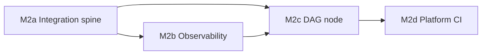

# Milestone 2 — Live DICE / RCA integration, ops hardening, agent DAG

**Status:** Planned  
**Builds on:** [Milestone 1](milestone-1.md) (PoC, contract, optional Leap, JSONL/H2 lite, Kotlin ingest types)  
**Spec:** [dwave.md](../dwave.md) · Metrics plan: [docs/DWAVE_REAL_WORLD_METRICS.md](../docs/DWAVE_REAL_WORLD_METRICS.md)

## Phased delivery (M2a → M2d)

Work is split so you can **ship a thin vertical slice first**, then **harden** with metrics and DAG shape, then **platform** CI/Maven.

| Phase | Name | Intent | Exit criteria (suggested) |
|-------|------|--------|---------------------------|
| **M2a** | **Integration spine** | RCA context → instance → solver → result back into the agent path (behind flags). | End-to-end demo on **recorded** fixtures: JVM emits instance JSON, invokes solver (subprocess/HTTP per ADR), parses `SolveRecord`, updates context; IT green without live Datadog. |
| **M2b** | **Observability** | Implement real-world metrics emission (not docs-only). | v1 field set logged or metered from solver path; sample queries or DD facets documented; links to JSONL/H2 where duplicated. |
| **M2c** | **DAG node & resilience** | Solver as **explicit** workflow node + timeouts / fallback / idempotency. | Orchestration diagram or code shows named node; policy for failure ≠ hard fail (e.g. heuristic fallback); spans/metrics at node boundary. |
| **M2d** | **Platform & CI** | Leap **opt-in** in CI; Maven umbrella + unified Java workflow. | Optional GH job when `DWAVE_API_TOKEN` set; root `pom.xml` (optional) + `java-modules.yml` (or equivalent) runs tests across Java modules with agreed skip-IT profile. |

**Suggested order:** **M2a** first (proves value), **M2b** in parallel once the first solver call exists, **M2c** refactors M2a hook into a proper node, **M2d** anytime but often last to avoid blocking feature work.

*(M2b can start after M2a has a single solver invocation; M2d can proceed in parallel if resourced.)*

---

## Purpose

Close the gap between **synthetic PoC** and **production-shaped** behavior:

1. **Wire real investigation context** from the Embabel/DICE RCA path into the **QUBO compiler path** (today: *no* automatic wiring from live Datadog-shaped runs into `dice-leap-poc` semantics inside `embabel-dice-rca` agents).
2. **Keep Leap cloud opt-in** (`DWAVE_API_TOKEN`); optionally add **CI jobs** that run only when secrets are present (never block default PRs).
3. **Implement** real-world metrics in **application/telemetry** (Milestone 1 only **documented** what to collect).
4. Treat the **solver as an explicit node** in the **agent / workflow DAG** (not built today).
5. **Repo engineering:** optional **Maven parent / aggregator** + **umbrella GitHub Actions** for all Java modules (today: **per-module** POMs; **path-scoped** workflows only).

---

## Work items by phase (checklist)

### M2a — Integration spine (`embabel-dice-rca` + solver boundary)

- [x] **A1 — Instance model in JVM** — `QuboInstancePayload` + `RcaCandidateToQuboInstanceMapper` map ranked candidates → dice-leap-poc JSON (`encoding_version` **1**).
- [x] **A2 — Extraction hook** — `RcaAgent` calls `QuboReportEnricher` after `buildReport` (rollover via `QuboRolloverPlanner`, aligned with Python thresholds).
- [x] **A3 — Solver invocation** — ADR [docs/adr/0002-dice-leap-subprocess-bridge.md](../docs/adr/0002-dice-leap-subprocess-bridge.md); `DiceLeapPythonSolver` runs `dice-leap-poc/scripts/solve_json.py` + `SolveRecordJsonlReader.parseLine`.
- [x] **A4 — Result interpreter** — `findings["qubo"]` includes `solve_record`, `selected_candidate_titles`, and an extra **recommendation** line when selections exist (deeper propositions/UI later).
- [x] **A5 — Feature flags** — `embabel.rca.qubo.enabled` default **false**; optional IT `DiceLeapPythonSolverIntegrationTest` if `DICE_LEAP_POC_ROOT` is set.

### M2b — Observability (metrics implementation)

- [ ] **C1 — Field list** — Freeze v1 minimum from [DWAVE_REAL_WORLD_METRICS.md](../docs/DWAVE_REAL_WORLD_METRICS.md) (case id, encoding version, strategy, solver mode, latencies, deltas, errors).
- [ ] **C2 — Emit** — Log / OTel / Micrometer (or structured logs) from JVM when solver runs; align with JSONL/H2 if duplicated.
- [ ] **C3 — Dashboards / queries** — Optional: Datadog facets / Grafana; document example queries in repo.

### M2c — Agent DAG node & resilience

- [ ] **D1 — Workflow model** — Identify Embabel/DICE orchestration; define solver **inputs/outputs** (instance in → `SolveRecord` out).
- [ ] **D2 — Idempotency & timeouts** — Retries, cancellation, **fallback** to heuristic on failure (prod may differ from M1 fail-fast).
- [ ] **D3 — Node observability** — Spans/metrics at node boundary (feeds **M2b**).

### M2d — Leap CI + Maven / CI umbrella

- [ ] **B1 — Document** — Token setup, quota, when Leap vs local SA.
- [ ] **B2 — Optional workflow** — `workflow_dispatch` or secret-gated job; `pytest -m leap` or smoke; **skip** if no `DWAVE_API_TOKEN`.
- [ ] **B3 — Policy** — Default required checks remain **local-only** unless team promotes Leap job.
- [ ] **E1 — Parent POM (optional)** — Root `pom.xml` with `<modules>`: `embabel-dice-rca`, `dice-server`, `test-report-server` (`dice-leap-poc` stays Python).
- [ ] **E2 — Unified workflow** — e.g. `.github/workflows/java-modules.yml`: `mvn` test, cache, Java 21.
- [ ] **E3 — Path strategy** — Full reactor vs path filters / `dorny/paths-filter` (team choice).

---

## Goals (Milestone 2 overall)

1. **End-to-end RCA → QUBO → back** on **realistic** (then real) data, behind flags (**M2a**).
2. **Measurable** pilots via implemented telemetry (**M2b**).
3. **Composable** agents: solver as a **first-class** step (**M2c**).
4. **Operable Leap** + **maintainable** multi-module CI (**M2d**).

## Non-goals (unless explicitly added)

- Replacing the entire RCA stack with QUBO-only logic.
- On-QPU production workloads.
- Perfect optimality on messy real graphs.

## Dependencies

- Stable **`SolveRecord`** + `encoding_version` (Milestone 1).
- **A3** ADR locked early in **M2a**.

## Risks

- Leap **latency/quota**; **PII** in logged instances.
- **DAG** complexity (duplicate calls, stale context).
- **Maven reactor** + flaky ITs — use `-DskipITs` profile until stable.

## References

- [milestone-1.md](milestone-1.md)  
- [dwave.md](../dwave.md)  
- [dice-leap-poc/README.md](../dice-leap-poc/README.md)  
- [test-report-server/README.md](../test-report-server/README.md)  

---

## Plan evolution

- **2026-01-25:** Milestone 2 drafted (gap analysis).
- **2026-01-25:** Split into **M2a–M2d** phases with exit criteria and checklist mapping.
- **2026-01-25:** M2a first slice: subprocess bridge, mapper, enricher, `solve_json.py`, ADR 0002.
